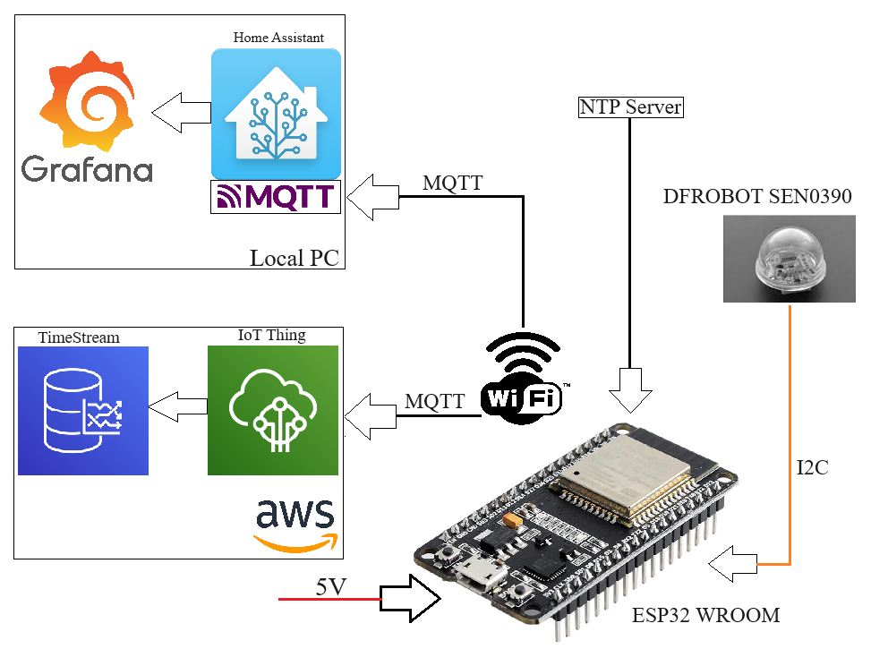

# 🌤️ DFRobot Light Sensor — IoT Light Intensity Monitor

ESP32-based IoT project measuring roof light intensity and publishing data to both local Home Assistant and AWS IoT Cloud.

📄 **Full documentation:** [English](documentation/documentation_EN.html) | [Slovenčina](documentation/documentation_SK.html)

---

## 1. Project Concept

This project measures **daylight intensity** (in lux) on a building rooftop. Two independent measurement units collect data and simultaneously publish it to two destinations — a local **Home Assistant** server and the **AWS IoT** cloud.



---

## 2. Hardware

### Components

| Component | Detail |
|---|---|
| **MCU** | ESP32 WROOM |
| **Sensor** | DFRobot B_LUX_V30B (SEN0390) — light intensity sensor |
| **Sensor communication** | I2C via flat ribbon cable, pin 13 (chip select) |
| **Power supply** | 5V via USB / industrial connector |
| **Enclosure** | Plastic installation box lined with aluminium foil (EMI shielding) |

### Unit Assembly

The ESP32 is mounted on a prototype PCB. The B_LUX_V30B sensor is routed outside the enclosure via a flat ribbon cable and covered with a transparent dome that protects it from mechanical damage while allowing light to pass through.


### Enclosure Assembly

The electronics are housed in an aluminium foil-lined box for EMI shielding. The power and communication connector exits through the bottom via an industrial screw connector.


### Final Unit

Closed enclosure — sensor dome on the front, industrial connector at the bottom.


### Installation

Both units are installed at a skylight window, sensors pointing upward towards the glass panel. The red LED on the ESP32 indicates the device is running.


---

## 3. System Architecture

Each unit communicates wirelessly via WiFi with three external services:

```
                  ┌─────────────────────────┐
                  │      NTP Server         │
                  │   pool.ntp.org (GMT+1)  │
                  └────────────┬────────────┘
                               │ time
              ┌────────────────▼─────────────────┐
              │           ESP32 WROOM            │
              │                                  │
              │  DFRobot SEN0390  ←── I2C ──┐    │
              │  (lux reading)        ribbon│    │
              │                        cable│    │
              └──────┬───────────────────────────┘
                     │ WiFi
          ┌──────────┴──────────┐
          │                     │
          ▼                     ▼
  ┌───────────────┐    ┌────────────────────┐
  │  Local PC     │    │       AWS          │
  │               │    │                   │
  │  Home Asst.   │    │  IoT Thing        │
  │  MQTT Broker  │    │  (MQTT/TLS 8883)  │
  │  port 1883    │    │                   │
  │      │        │    │  TimeStream DB    │
  │      ▼        │    └────────────────────┘
  │   Grafana     │
  └───────────────┘
```

---

## 4. Code Description — Functional Blocks

### 4.1 Initialization — `setup()`

A one-time initialization runs on ESP32 startup:
- Start serial port (`115200 baud`)
- Connect to WiFi network — waits in a loop until successfully connected
- Initialize the light sensor `myLux.begin()`
- Load AWS TLS certificates (CA, device cert, private key) stored in `PROGMEM`
- Configure MQTT servers — AWS (`port 8883`) and local HA (`port 1883`)
- Start the NTP client for time synchronization

### 4.2 Data Acquisition — `sensorData()`

- Requests current time from the NTP server (`forceUpdate()`)
- Reads light intensity from the sensor → value in lux (`double` cast to `int`)
- Builds a JSON message and stores it in the shared buffer `jsonBuffer[512]`

```json
{
  "light": 8137,
  "date": "2024-06-12 12:57:24",
  "id": "roof1"
}
```

### 4.3 Local MQTT Publishing — `sendToLocalMQTT()`

- Checks whether the connection to the local HA broker is active
- If not → connects using `HA_MQTT_USER` / `HA_MQTT_PASSWORD`
- Publishes JSON to topic `home/roof/roofLight_1`

Received message as seen in the Home Assistant MQTT broker:


### 4.4 AWS Publishing — `sendToAWS()`

- Establishes an encrypted TLS connection to the AWS IoT endpoint (port `8883`)
- Authentication via RSA certificates (stored in `secrets.h`)
- Subscribe → Publish JSON → Unsubscribe → Disconnect
- Connection is closed after every publish cycle

### 4.5 WiFi Management — `reconnectWiFi()`

- If WiFi drops, calls `disconnect()` → `reconnect()`
- Waits in a 5-second loop until connection is restored

### 4.6 Main Loop — `loop()`

```
┌─────────────────────────────┐
│  WiFi connected?            │
│  NO  → reconnectWiFi()      │
│                             │
│  sensorData()               │
│  → YES: sendToLocalMQTT()   │
│         sendToAWS()         │
│                             │
│  client.loop()              │
│  delay(10 000 ms)           │
└─────────────────────────────┘
         ↑ repeats indefinitely
```

Measurements are taken every **10 seconds** (`LOOP_PERIOD = 10000 ms`).

---

## 5. Data Storage — AWS TimeStream

Data received via AWS IoT is stored in the **Amazon Timestream** database (table `Sensors.roofSensor`).

Each record contains:
- `SensorID` → `roof1`
- `measure_name` → `light` (int) or `date` (varchar)
- `time` → AWS ingestion timestamp
- `measure_value` → measured value


---

## 6. Visualization — Grafana

Data from both sensors is displayed in the **Grafana dashboard** "Roof Light Sensors". The graph shows the average light intensity (`lx.mean`) over time, refreshing every 5 seconds.

A typical daily pattern is visible — peak around noon (~14,000–15,000 lux), lower values in the morning and afternoon.


---

## 7. Configuration — `secrets.h`

This project uses a `secrets.h` file for all credentials. **This file is not included in the repository** — it contains sensitive data.

For your own deployment, create `secrets.h` using the following template:

| Parameter | Description |
|---|---|
| `THINGNAME` | AWS IoT device name |
| `AWS_IOT_ENDPOINT` | AWS IoT endpoint URL |
| `AWS_IOT_PUBLISH_TOPIC` | MQTT topic for publishing |
| `AWS_IOT_SUBSCRIBE_TOPIC` | MQTT topic for subscribing |
| `WIFI_SSID` | WiFi network name |
| `WIFI_PASSWORD` | WiFi password |
| `TIMEOFFSET` | Timezone offset in seconds (GMT+1 = 3600) |
| `HA_MQTT_SERVER` | IP address of the local HA MQTT broker |
| `HA_MQTT_PORT` | MQTT broker port (default 1883) |
| `HA_MQTT_USER` | MQTT username |
| `HA_MQTT_PASSWORD` | MQTT password |
| `HA_MQTT_TOPIC` | MQTT topic for Home Assistant |
| `PUBLISH_MESSAGE_ID` | Message identifier (e.g. `roof1`) |
| `LOOP_PERIOD` | Measurement interval in ms (10000 = 10 sec) |
| `AWS_CERT_CA` | Amazon Root CA certificate |
| `AWS_CERT_CRT` | Device certificate |
| `AWS_CERT_PRIVATE` | Device RSA private key |

---

## 8. Libraries Used

| Library | Purpose |
|---|---|
| `WiFiClientSecure` | Encrypted WiFi connection (TLS) for AWS |
| `PubSubClient` | MQTT client |
| `ArduinoJson` | JSON data serialization |
| `NTPClient` + `WiFiUdp` | Time synchronization via NTP |
| [`DFRobot_B_LUX_V30B`](https://github.com/DFRobot/DFRobot_B_LUX_V30B) | Light sensor driver |

---

## 9. Two Deployed Devices

| | Unit 1 | Unit 2 |
|---|---|---|
| **THINGNAME** | `roofLight_1` | `roofLight_2` |
| **Message ID** | `roof1` | `roof2` |
| **AWS topic** | `house/roof/roofLight_1` | `house/roof/roofLight_2` |
| **HA topic** | `home/roof/roofLight_1` | `home/roof/roofLight_2` |
| **Interval** | 10 seconds | 10 seconds |

> The repository code is for unit `roofLight_1`. For the second unit, simply update the relevant values in `secrets.h`.

---

## License

MIT License — see [LICENSE](LICENSE)
